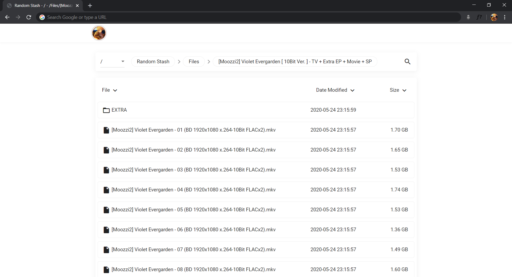

<p align="center"></p>

# goIndex-theme-nexmoe

Based on panta js, refer to OneIndex's theme nexmoe, magic change beautification.

App-v3.js is based on yanzai's js beautification, supports features such as multi-disk, search, pagination and call-to-external player, plus DPlayer playback.

### How to Use
1. Open https://install.kenci.workers.dev

2. Complete authorisation and input all the details and generate code

3. Head over to the index.js file and input the client id ,client secret, refresh token and root id from the code generated in step 2

4. Deploy this index.js code to Cloudflare Workers

### Extra Options
``` js
const uiConfig = {
  .......
  "avatar": "https://i.ibb.co/jW0TDZH/image.png",  // Changes the avatar image in the navbar (Changeable only if language is en)
  "disable_navicon": true // Disables useless nav menu in navbar (Changeable only if language is en)
  "language": "en" // en - english, default or anythin else for zh-cn
  .......
};
```

### Demo (Chinese)

[app-v2.js](https://go.zgh.workers.dev/) 

[app-v3.js](https://demo.zgh.workers.dev/) 
